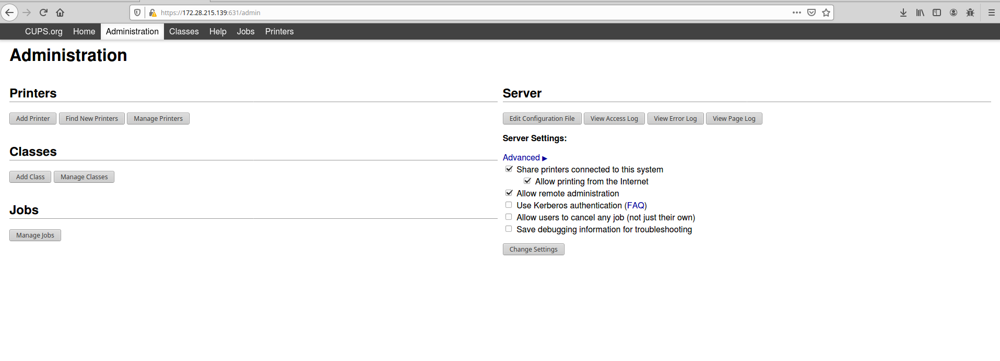
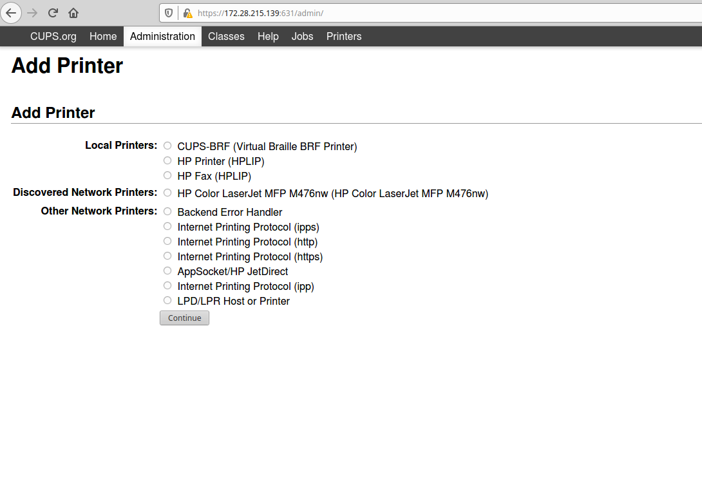
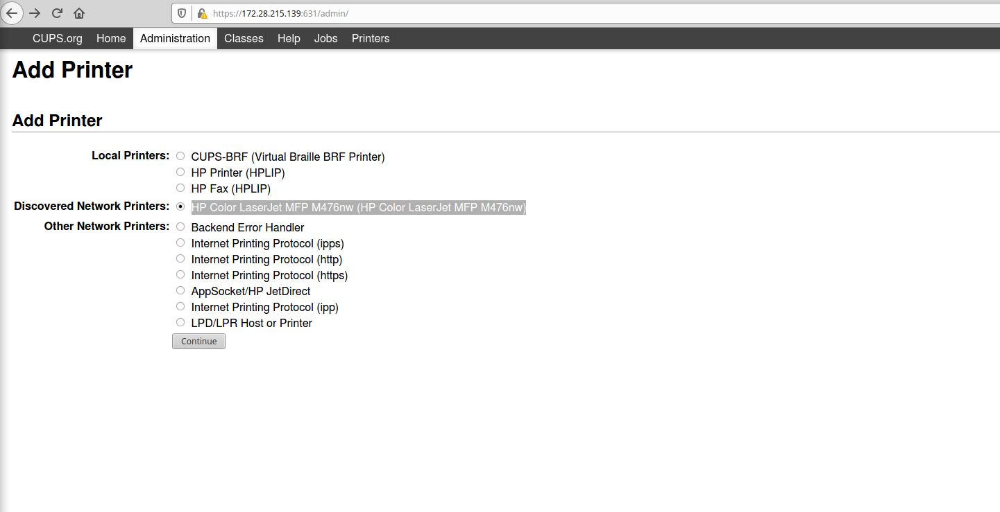
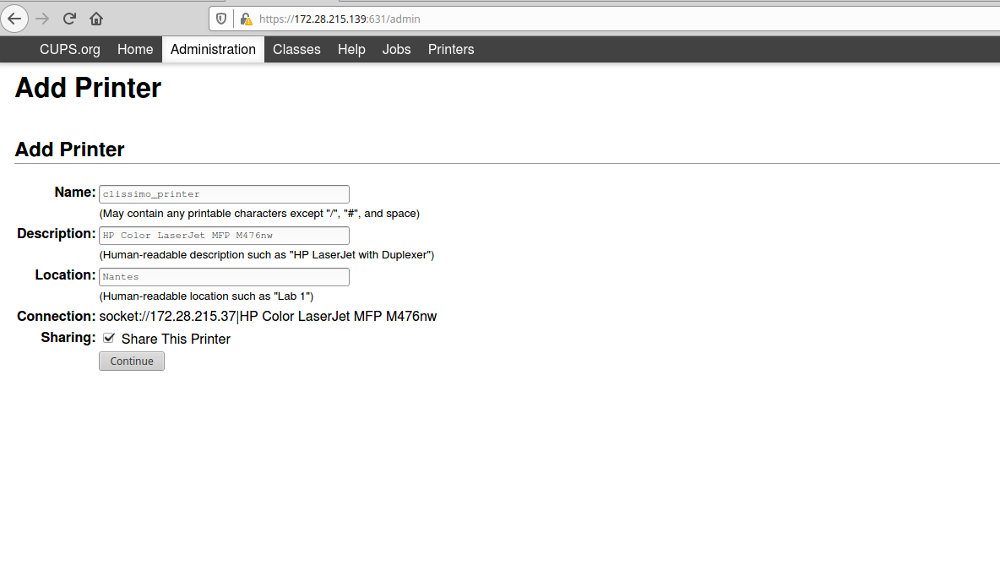

Raspberry
=========

# Generation image Raspberry

Nous avons développé un script basé sur [le script d'odoo](https://github.com/odoo/odoo/blob/13.0/addons/point_of_sale/tools/posbox/posbox_create_image.sh)
 sur le script d'odoo pour générer une image préconfigurée raspbian_teclib.img.

#### Créer une carte SD pour la Raspberry sous Linux:
1. Pré-requis :

- Une carte SD ou Micro-SD selon le raspberry
- l'image raspbian_teclib.img ou une image [standard](https://www.raspberrypi.org/downloads/raspbian/) sans desktop.

2. Charger la carte SD

- [balenaEtcher](https://www.balena.io/etcher/) est généralement l'option la plus simple pour la plupart des utilisateurs pour écrire des images sur des cartes SD, c'est donc un bon point de départ. Si vous recherchez des options plus avancées sur Linux, vous pouvez utiliser les outils de ligne de commande standard ci-dessous.

- <strong> Remarque:</strong> l'utilisation de l'outil dd peut remplacer n'importe quelle partition de votre machine. Si vous spécifiez le mauvais périphérique dans les instructions ci-dessous, vous pouvez supprimer votre partition Linux principale. S'il vous plaît soyez prudente.

3. Découvrir le point de montage de la carte SD et le démonter

- Exécutez lsblk -p pour voir quels périphériques sont actuellement connectés à votre machine
- Si votre ordinateur dispose d'un emplacement pour cartes SD, insérez la carte. Sinon, insérez la carte dans un lecteur de carte SD, puis connectez le lecteur à votre ordinateur.
- Exécutez à nouveau lsblk -p. Le nouvel appareil qui est apparu est votre carte SD (vous pouvez également généralement le dire à partir de la taille de l'appareil indiquée). La dénomination de l'appareil suivra le format décrit dans le paragraphe suivant.
- La colonne de gauche des résultats de la commande lsblk -p donne le nom du périphérique de votre carte SD et les noms des partitions sur celle-ci (généralement une seule, mais il peut y en avoir plusieurs si la carte a été utilisée précédemment). Il sera répertorié comme quelque chose comme /dev/mmcblk0 ou /dev/sdX (avec les noms de partition /dev/mmcblk0p1 ou /dev/sdX1 respectivement), où X est une lettre minuscule indiquant le périphérique (par exemple. /dev/sdb1 ). La colonne de droite indique où les partitions ont été montées.
- Dans un terminal, écrivez l'image sur la carte avec la commande ci-dessous, en vous assurant de remplacer le fichier d'entrée if = argument par le chemin d'accès à votre fichier .img, et le /dev/sdX dans le fichier de sortie de = argument par le bon nom de la carte.<strong> Ceci est très important, car vous allez perdre toutes les données si vous fournissez le mauvais chemin. (Attention !!!) </strong>
- Assurez-vous que le nom de la carte SD entière comme décrit ci-dessus, pas seulement une partition. Par exemple: sdd, pas sdds1 ou sddp1; mmcblk0, pas mmcblk0p1.  dd bs=4M if=raspbian_teclib.img of=/dev/mmcblk0 status=progress
- Veuillez noter que la taille de bloc définie sur 4M fonctionnera la plupart du temps. Sinon, essayez 1M, bien que cela prenne beaucoup plus de temps.
- Notez également que si vous n'êtes pas connecté en tant que root, vous devrez le préfixer avec sudo.

#### Configurer cups:

-  Common Unix Printing System (CUPS) est un système modulaire d'impression numérique pour les systèmes d'exploitation Unix et assimilés. Tout ordinateur qui utilise CUPS peut se comporter comme un serveur d'impression ; il peut accepter des documents envoyés par d'autres machines (ordinateurs clients), les traiter, et les envoyer à l'imprimante qui convient.

1. Ajouter une imprimante sur le serveur CUPS:

> 

Cliquez sur Add Printer:

> 

Sur cette page vous avez tous les protocols possible communications de entre les imprimantes et le serveur Cups

Ajoutez l'imprimante (Exemple clissimo_printer)

Après avoir sélectionné l'imprimante "HP Color LaserJet MFP M476nw (HP Color LaserJet MFP M476nw)"

> 

Cliquez sur continu

> 

if faut bien noter que printer name est unique (dans notre cas colissimo_printer)

